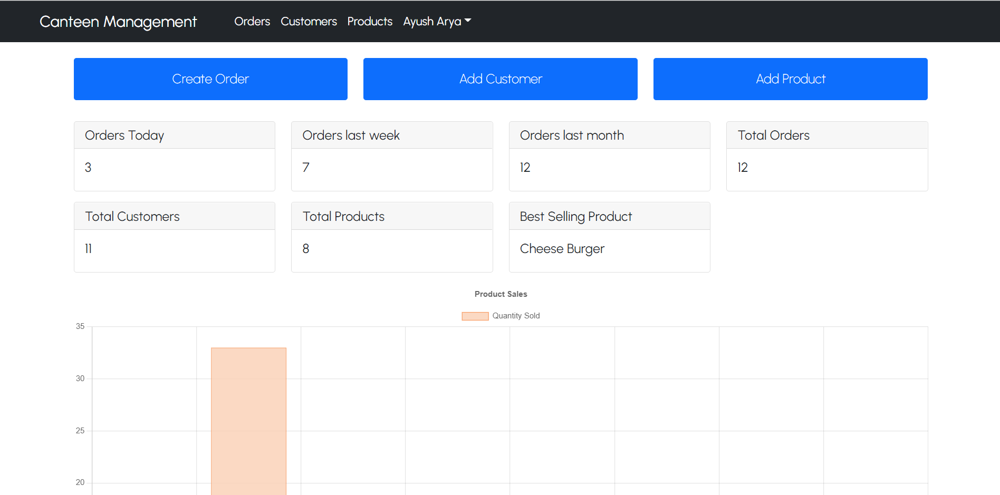

# **Canteen Management System**

A web app for managing *billing, customers, orders, statistics* for a canteen. 

This app is built using ***MongoDB, ExpressJS, NodeJS, and React*** and is hosted on ***Heroku***. It uses *Json Web Tokens* for user authentication.

- On Client side, it uses ***Redux*** for state management and ***Axios*** as HTTP client. ***Chart.js*** along with ***react-chartjs-2*** is used to create bar chart and ***html2pdf.js*** is used to generate pdf from html.

- On Server side, it uses ***mongoose*** as ORM for MongoDB, ***express-async-handler*** for handling errors asynchronously, ***bcrypt*** for hashing passwords and ***moment.js*** for working with dates.

\
Click the link below and check it out now:\
https://cms-billing.herokuapp.com/ 

Check out my personal site for more apps like this:\
https://aryaayush.netlify.app/

